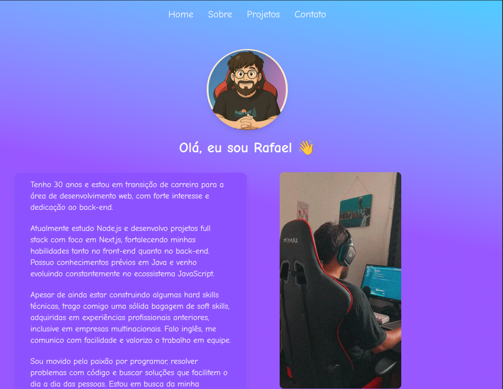
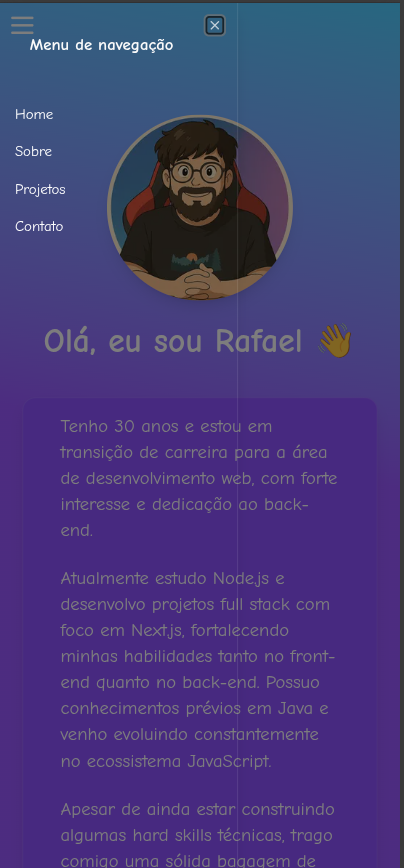
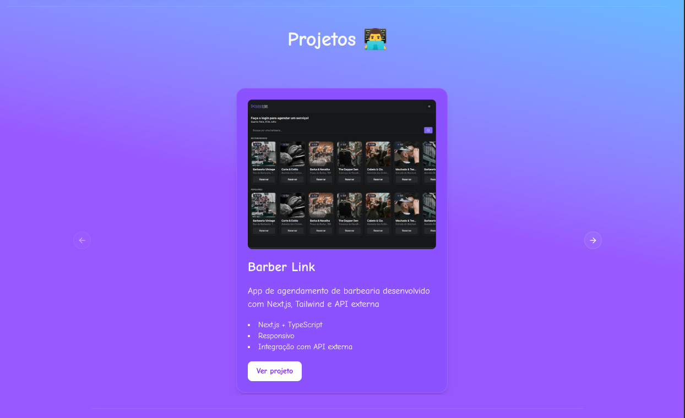
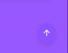
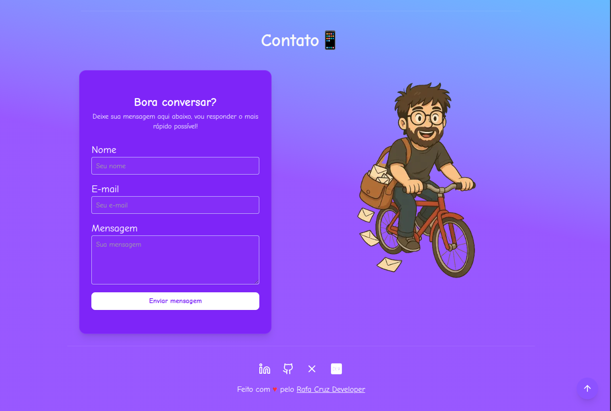

# 🚀 Portfólio - Rafael Cruz

Este é meu portfólio profissional desenvolvido com Next.js, TypeScript, Tailwind CSS e shadcn/ui. Aqui você encontrará informações sobre mim, meus projetos e formas de contato.

## 🔗 Acesse

👉 [rafaelcruzdev.com](https://rafaelcruzdev.com)

## ✨ Tecnologias e ferramentas

- [Next.js 14](https://nextjs.org/)
- [TypeScript](https://www.typescriptlang.org/)
- [Tailwind CSS](https://tailwindcss.com/)
- [shadcn/ui](https://ui.shadcn.com/)
- [Lucide Icons](https://lucide.dev/)
- [Resend](https://resend.com/) – API para envio de e-mails
- [Vercel](https://vercel.com/) – Deploy

## ✉️ Envio de mensagens

O formulário de contato da página utiliza a **API do Resend** para envio de e-mails de forma segura e escalável. Nenhum dado é salvo em banco de dados – apenas enviado diretamente para minha caixa de entrada via API.

## 📱 Mobile First

O layout foi pensado para funcionar perfeitamente em dispositivos móveis, com navegação via **sidebar responsiva**, **carrossel com indicadores adaptados para touch** e carregamento leve.

## 📸 Screenshots

| 🖥️ Desktop                                             | 📱 Mobile                                            |
| ------------------------------------------------------ | ---------------------------------------------------- |
|   |   |
| -----------------------------------------------------  | ---------------------------------------------------  |
|  |  |
| -----------------------------------------------------  | ---------------------------------------------------  |
|  |
